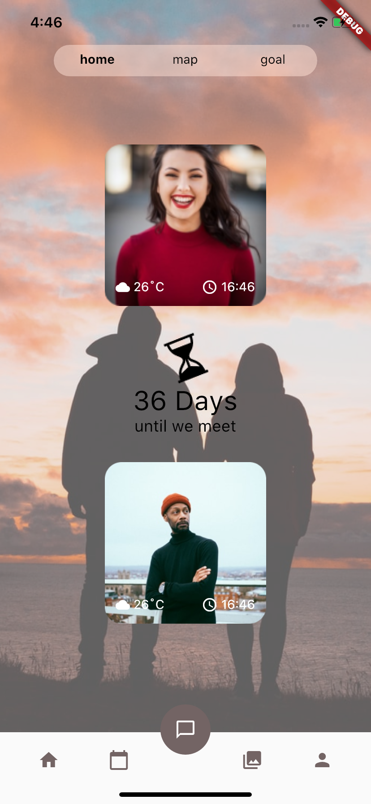

# Onli-Homepage

Onli is an flutter phone application for couples. We are implementing different features such as chat, calandar, photo album, and map.

* [x] Implemented UI of homapage
* [x] Plugged in DateTime class to obtain current time update by minute
* [x] Used **OpenWeather API** to obtain current weather at the city of the user

GIF created with [LiceCap](http://www.cockos.com/licecap/).
